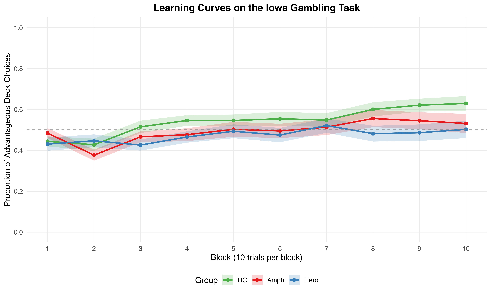

# Memory Decay in Reinforcement Learning

Hierarchical Bayesian analysis investigating whether substance use disorders are associated with elevated memory decay rates during reinforcement learning on the Iowa Gambling Task (IGT).

## Research Questions

**Primary:** Do individuals with substance use disorders exhibit elevated memory decay rates in reinforcement learning compared to healthy controls?

**Secondary:**
1. Can impaired IGT performance in substance use disorders be explained by memory retention deficits (high λ) rather than learning acquisition deficits?
2. Does the EEF model (with explicit forgetting) provide better fit compared to models assuming perfect memory (PVL-Delta) or asymmetric reward/punishment processing (ORL)?
3. Do different substance classes (stimulants vs. opioids) demonstrate distinct forgetting profiles?

## Computational Models

| Model | Parameters | Key Mechanism | Reference |
|-------|-----------|---------------|-----------|
| **EEF** | 4 | Exploration and Exploitation with Forgetting (λ) | Yang et al. (2025) |
| **PVL-Delta** | 4 | Prospect Theory + Delta Learning | Steingroever et al. (2013) |
| **ORL** | 5 | Outcome-Representation Learning | Haines et al. (2018) |

## Data

Data from Ahn et al. (2014), available through the hBayesDM package:

| Group | N | Description |
|-------|---|-------------|
| Healthy Controls | 48 | No history of substance dependence |
| Amphetamine | 38 | History of amphetamine dependence (abstinent > 1 month) |
| Heroin | 43 | History of heroin dependence (abstinent > 1 month) |
| **Total** | **129** | |

## Results

The EEF model showed superior fit for clinical groups (DIC advantage of 18-65 points over ORL), while ORL fit healthy controls marginally better. No credible group differences on forgetting rate (λ) were found.



## Requirements

- R >= 4.0
- JAGS >= 4.3
- R packages: `R2jags`, `rjags`, `coda`, `ggplot2`, `dplyr`, `tidyr`, `HDInterval`

## Usage

### Model Fitting
```bash
Rscript scripts/fitting/fit_eef.R HC
Rscript scripts/fitting/fit_orl.R Amph
Rscript scripts/fitting/fit_pvl_delta.R Hero
```

### Posterior Predictive Checks
```bash
Rscript scripts/ppc/run_ppc.R eef HC
Rscript scripts/ppc/run_ppc.R orl Amph
```

### Parameter Recovery
```bash
Rscript scripts/recovery/recovery_eef.R
Rscript scripts/recovery/recovery_orl.R
Rscript scripts/recovery/recovery_pvl_delta.R
```

### Generate Figures
```bash
Rscript scripts/plotting/create_paper_figures.R
Rscript scripts/plotting/plot_behavioural_data.R
Rscript scripts/plotting/plot_ppc_barplot.R
Rscript scripts/plotting/plot_recovery_from_rds.R eef
```

## Repository Structure

```
decision_making/
├── models/                  # JAGS model definitions
├── scripts/
│   ├── fitting/             # Hierarchical model fitting
│   ├── recovery/            # Parameter recovery simulations
│   ├── ppc/                 # Posterior predictive checks
│   ├── group_comparison/    # Group difference analysis
│   └── plotting/            # Visualization scripts
├── utils/                   # Shared R functions
├── data/
│   ├── raw/                 # Original Ahn et al. (2014) data
│   └── processed/           # Fitted models, recovery results, PPC
└── figures/
    └── paper/               # Publication figures
```

## References

- Ahn, W.Y., et al. (2014). Decision-making in stimulant and opiate addicts in protracted abstinence. *Neuropsychopharmacology*.
- Haines, N., Vassileva, J., & Ahn, W.Y. (2018). The Outcome-Representation Learning model. *Cognitive Science*.
- Steingroever, H., Wetzels, R., & Wagenmakers, E.J. (2013). A comparison of reinforcement-learning models. *Journal of Mathematical Psychology*.
- Yang, X., et al. (2025). Exploitation and Exploration with Forgetting. *Frontiers in Psychology*.
